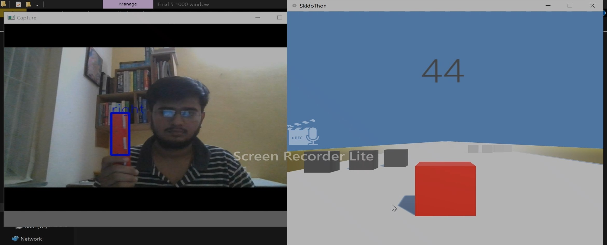

# UnityGame-GestureBased
Play game without mouse or keyboard.

Working:
A python server is built which can handle multiple client(to support restart of game) is built. This server detects object and based on 
it's movement it sends message as "Left" or "Right" to client file.
Client is game thread which continuously reads data sent by server. Based on movement info received, object is moved.
And when player dies, "Stop" is written on file named "data.txt" this will raise exception on server thread and aborts that thread.

Screen Shot:

